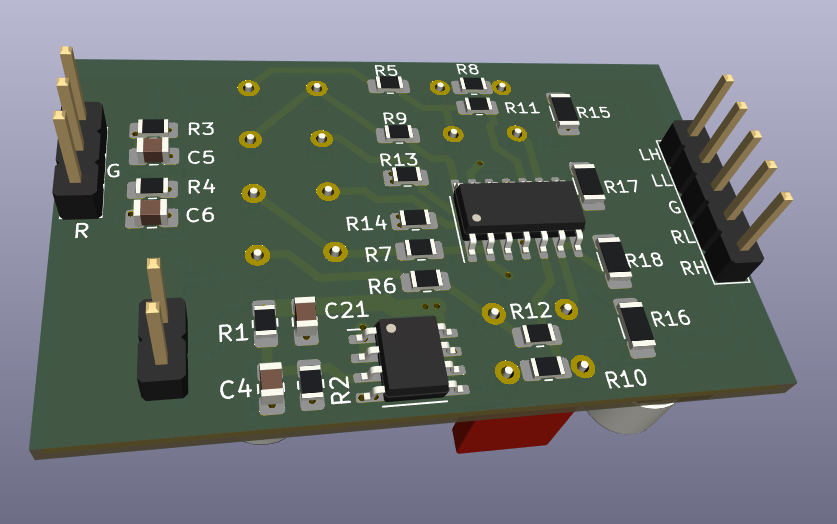
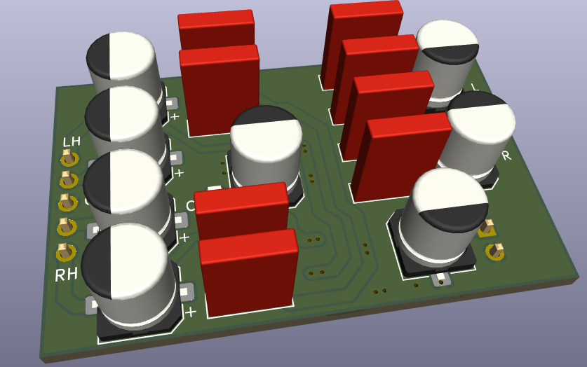

# Stereo 2-way 2nd order active crossover (Sallen Key)

Crossover frequency Fc = 1/( 2 * pi * R * C)

In the schematic, R = 5.6K, C = 100nF, so Fc ~= 284 Hz.

## Top

## Bottom

## 2.1 option
For a 2.1 amplifier filter configuration:  

* Do not populate R12, R18, C14, C16, C19
* Populate R6
* Populate R10 so that the unused opamp U2B +input is not floating.
* Solder a jumper wire across x1, x2 points in the schematic
* The summed low-pass filter output is on LLo output

